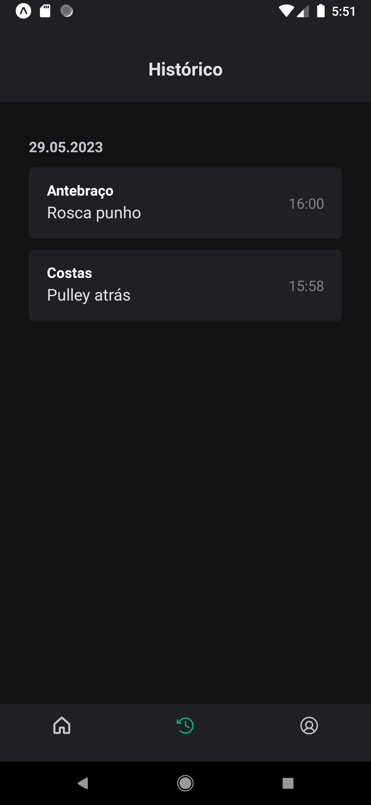

# IgniteGym

Uma aplicação para academia onde podemos criar conta, fazer login, editar perfil, ver exercícios, marcar exercício como concluído. Nessa aplicação foi utilizado o React Native.

## Screenshots

